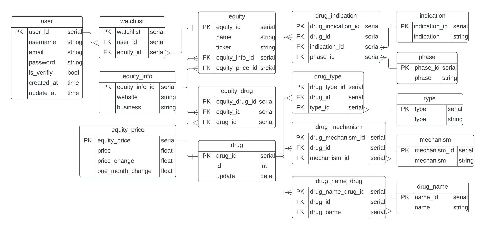

# Introduction
Live: https://www.biotechalfa.com/

This biotech investment research tool is a full-stack web application built with the latest technologies. The use of `Create T3-app` has ensured that it offers superior scalability compared to its previous version, which was created using `JavaScript, Next.js, and MongoDB`. The implementation of `tPRC, TypeScript, Prisma, Nextjs, and PostgreSQL` guarantees type safe and  efficient development environment that can handle even the most complex relationships in the data.

While the next logical step for this project would be to add stock price and financial data, I must be mindful of the potential technological and financial challenges. A stream data approach could result in frequent database queries, increasing the overall cost of the project. Similarly, third-party APIs for this information can also come with a high price tag. For now, I have decided to conclude the development of this project at this stage.

- [ ] Migrate to T3 stack
  - [X] Design a SQL database
  - [X] Redesign UI
  - [X] Static Site Generation (SSG)
  - [ ] Migrate stock data from MongoDB 
- [ ] Drug pipeline data model
  - [X] Web scraping drugs data
  - [ ] Full automated model
- [ ] Financial/Price data
  - [ ] Websocket for streaming stock price
  - [ ] Momentum tracker
  - [ ] Financial indicators
- [ ] User
  - [ ] Watchlist
  - [ ] Webhook email notification

# Demo
| Home | Stock |
| - | - |
| |  |

# Database Design

